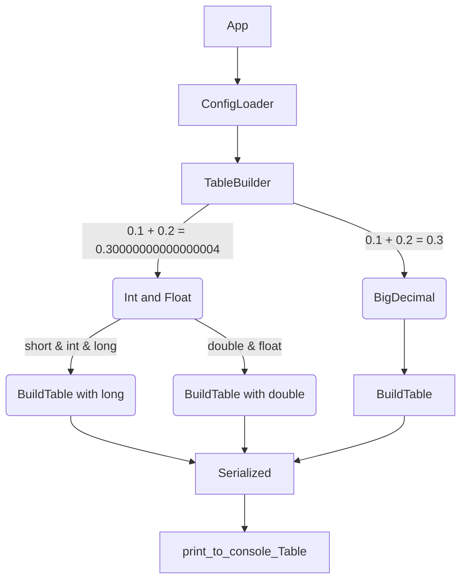
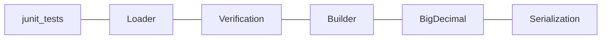

---
Global Refactoring Plan
---

```mermaid
graph TD
    App --> ConfigLoader --> 
        TableBuilder --> 
            |0.1 + 0.2 = 0.30000000000000004| 1(Int and Float) --> 
                |short & int & long| 1a(BuildTable with long) --> Serialized
            1(Int and Float) --> 
                |double & float| 1b(BuildTable with double) --> Serialized
        TableBuilder --> 
        |0.1 + 0.2 = 0.3| 2(BigDecimal) -->
            BuildTable --> Serialized -->
            print_to_console_Table
```
---
Testing Application
---

```mermaid
graph LR
    junit_tests --- Loader
    Loader --- Verification
    Verification --- Builder
    Builder --- BigDecimal
    BigDecimal --- Serialization
```
